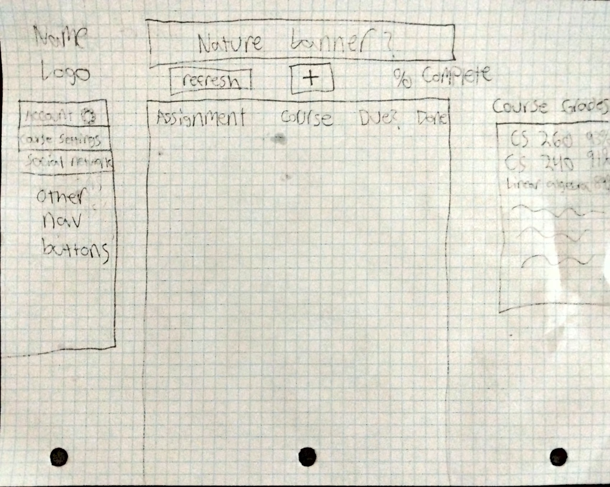

# Startup Project

## Elevator Pitch

I will create a website for students that combines assignment tracking, time management, and grades received. This will enable students to create daily schedules, check off completed tasks, and keep track of their grades, all on the same website.

## Key Features

Key features include:
- Account Creation and Sign In
- Assignment Creation
- Course Creation
- Grade Tracking
- Due Date Tracking
- Option to Share Course Completion Percentage with Others

## Technology Use

### HTML/CSS
Used to display the webpage to users.

### JavaScript/React
Provides framework for buttons and user interaction.

### Service
Backend service with endpoints for:
- Securely storing and retrieving academic information
- Handling login requests
- Storing custom course grading scales and assignment types

### DB/Login
Stores users, assignments, and grades in a database. Registers and logs in users. Securely stores credentials and academic information.

### WebSocket
Allows optional sharing of course/assignment completion with other users.

## Rough Sketch

### Deployment of initial HTML files
Created the initial html files for each page of the site, including:

-index.html
-about.html
-accountCreation.html
-accountSettings.html
-courseSettings.html
-home.html
-schedule.html
-signout.html

Added functional links between the pages, including a temporary bypass login link on index.html that enables natural navigation while accounts are not implemented. Used the code in deployFiles.sh to deploy it to the site with the following command :
 ./deployFiles.sh -k ../Diddlywhack_Doodad.pem -h jlarson.click -s startup

### HTML Deliverable
- [x] HTML pages- Eight HTML pages that represent account creation, login/logout, settings, and the homework schedule
- [x] Links- functional links between the pages
- [x] Text- Text explaining all the buttons, and descriptions of what goes where
- [x] Images- Successfully placed a generic schedule image on the front page
- [x] DB/Login-placeholder for a login on the main page
- [x] WebSocket- Included chat.html which is a placeholder for a live chat across accounts that will be powered by Websocket

